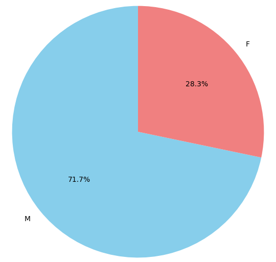
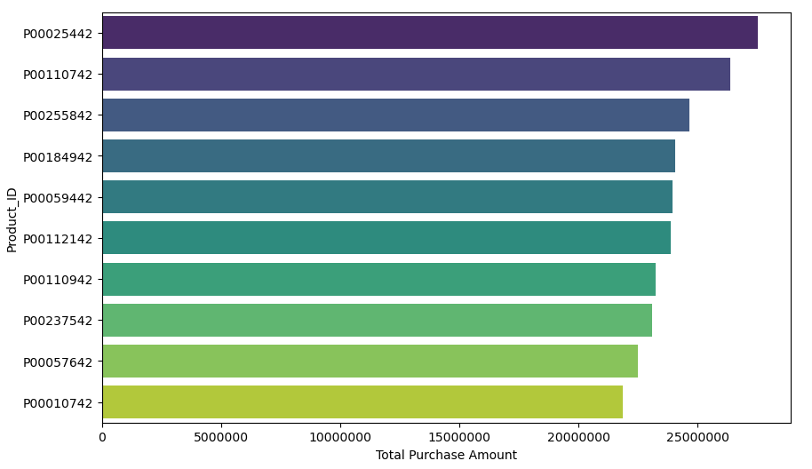
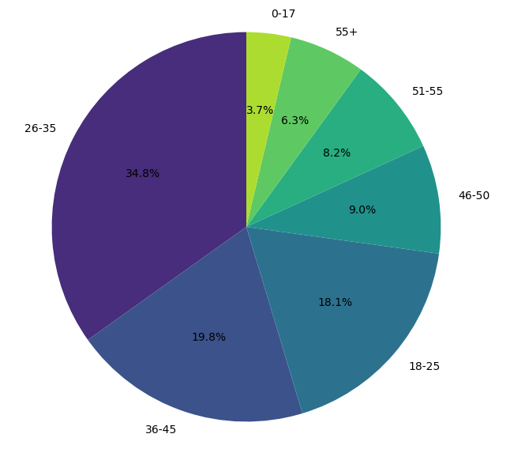
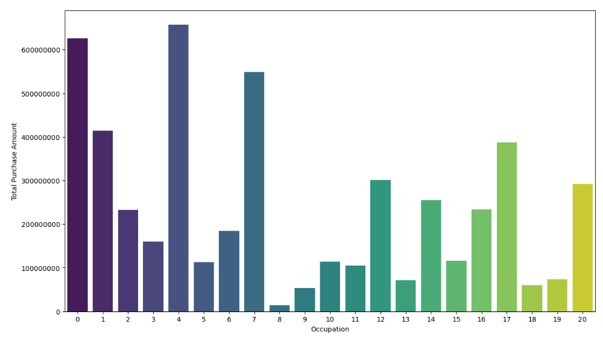

# 🛍️ Black Friday Sales Exploratory Data Analysis (EDA) 📊

## Overview

Welcome to our Black Friday Sales EDA project! Here, we dive into the exciting world of Black Friday shopping sales 🎉. Our goal is to unravel intriguing insights from the Black Friday sales data, uncovering hidden trends and patterns that could guide businesses to shopper satisfaction and increased revenue 💰.

## Dataset 📈

In our treasure trove of data, we have `black_friday_sales.csv`. It's packed with details about User_ID, Product_ID, Gender, Age, Occupation, City_Category, Stay_In_Current_City_Years, Marital_Status and Product_Category_1.

## Files 📁

- [`black_friday_sales.csv`](https://github.com/Analyticalgeek/Data-Analysis-Projects/blob/main/Black%20Friday%20Sales/Data/BlackFriday.csv): Our main dataset, the heartbeat of our analysis.
- [`Black_Friday_Sales_EDA.ipynb`](https://github.com/Analyticalgeek/Data-Analysis-Projects/blob/main/Black%20Friday%20Sales/Notebooks/Black%20Friday%20Sales%20Analysis.ipynb): Behold our Jupyter Notebook, where magic happens with Python 🐍 code, uncovering the secrets of Black Friday shopping habits.
- `README.md` (you're here!): Your guide to this exhilarating journey through Black Friday sales data.

## Requirements 🛠️

Ensure you have the following Python libraries installed:

- pandas 🐼
- numpy 🔢
- matplotlib 📊
- seaborn 📈

Install them with a below code:

```
pip install pandas numpy matplotlib seaborn
```

## Analysis 🧐

Analysis revealed fascinating insights into Black Friday sales:

**1.Revenue Generated** : jaw-dropping total revenue of **$5,017,668,378**!

**2.Average Revenue**: Each shopper spent an average of **$9333.86**

**3.Total Customers**: We had a bustling crowd of **5891** shoppers join the Black Friday sales!

**4.Inventory Highlights**: store has a **3623** products.

**5.Gender Distribution**: *Gender Distribution In Sales*

<p align="center">
  <br>
</p>


**5.Top Spender**: User ID **1004277**  is the top spender in the Black Friday sales.

**6.Hot-Selling Product**: Product ID **P00265242** is the ultimate crowd-pleaser.

**7.Most Revenue generated Product**: Product ID **P00025442** is the most revenue generated product

<br>

<p align="center">
  <br>
  <em>Caption: Top 10 Highest Revenue Generated Products</em>
</p>

<br>

**8.Product Frequently Bought by Both Genders**: Product ID **P00265242**

**9.Most Revenue Generated Product Among Females**: The Product ID **P00255842** among female shoppers.

**10.Most Revenue Generated Product Among Males**: The Product ID **P00025442** which is also hot selling product.

**11.Popular product among all age groups**: The Product ID **P00265242**

**12.Age Insights**: The **26-35 age group dominated** the shopping scene, closely followed by the 36-45 age bracket.
<br>
<p align="center">
  <br>
  <em>Caption: Different Age groups in Black Friday Sales</em>
</p>
<br>

**13.City**: City 'C' saw the most action, while **City 'B' raked in the most revenue**. Cities 'A' and 'C' were hotspots for the 26-35 age group.

**14.Marital Status**: Users with Marital Status '0' are more in number.

**15.Product Category**: Category 5 Products are purchased more, while **Category 1** stole the show **in revenue generation.**

**16.Occupation**: Occupation 4 has generated the highest Revenue
<br>
<p align="center">
  <br>
  <em>Caption: Occupations with Total Purchase Amount</em>
</p>
<br>


## Conclusion 🎇

This analysis offers a deep dive into the dynamics of Black Friday sales, uncovering key insights that can guide businesses in tailoring their strategies to maximize revenue and shopper satisfaction 🚀.

---
