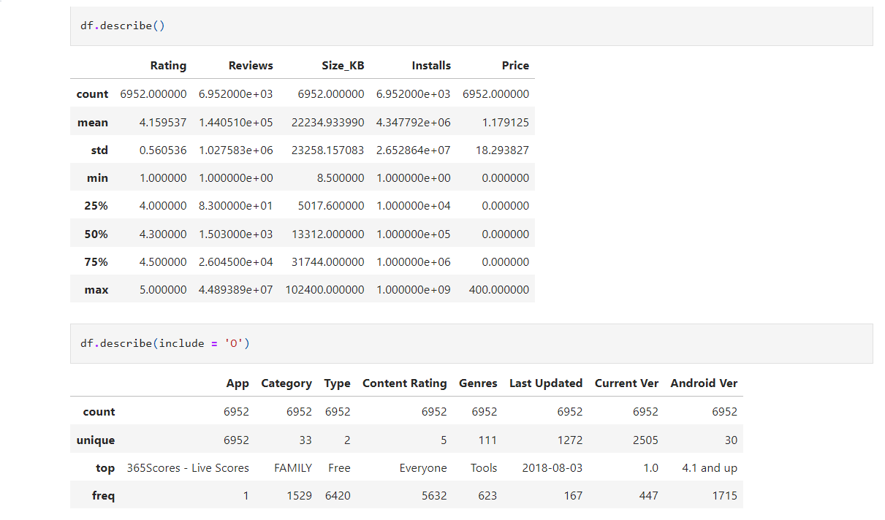

# 📱 Google Play Store App's Exploratory Data Analysis (EDA) 

## Introduction
Welcome to my Google Play Store Data Analysis project! In this repository, I explore and analyze data from the Google Play Store to uncover insights into app trends, user preferences, and factors influencing app success on the platform.

## Data 📊
The [dataset](https://github.com/Analyticalgeek/Data-Analysis-Projects/blob/main/Google%20Play%20Store/Data/googleplaystore.csv) I utilize for this analysis contains comprehensive information about various apps available on the Google Play Store. It includes details such as app names, categories, ratings, reviews, sizes, Installs, Type, Price, Content Rating, Genres , Last Updated , Current Ver, Android Ver.

## Requirements 🛠️

Ensure you have the following Python libraries installed:

- pandas 🐼
- numpy 🔢
- matplotlib 📊
- seaborn 📈

Install them with a below code:

```
pip install pandas numpy matplotlib seaborn
```
## Data Cleaning 🧹

Before diving into analysis, I cleaned the dataset to ensure its quality and consistency. This involved handling missing values, removing duplicates, and addressing any inconsistencies in the data. By performing these preprocessing steps, I ensured that the dataset was ready for analysis.

**Notebook detailing the data cleaning**: [Data clean Notebook](https://github.com/Analyticalgeek/Data-Analysis-Projects/blob/main/Google%20Play%20Store/Notebooks/Google%20Play%20Store%20Data%20Cleaning.ipynb)

**Final Cleaned DataSet**: [Cleaned Dataset](https://github.com/Analyticalgeek/Data-Analysis-Projects/blob/main/Google%20Play%20Store/Data/cleaned_data.csv)

## Summary Statistics 📝

After cleaning the dataset, I computed summary statistics to get an overview of the data. This included measures such as mean, median, standard deviation, and range for relevant variables. These summary statistics provided initial insights into the distribution and characteristics of the data.

<br>
<p align="center">
  <br>
  <em>Caption: Summary Statistics of the Data</em>
</p>
<br>


## Analysis 🧐

I start the analysis by conducting exploratory data analysis (EDA) to gain initial insights into the dataset. Using statistical techniques and visualizations, I identify trends, correlations, and outliers. These findings are then summarized. 

## Code 💻
The Noteook section of this repository contains  Jupyter notebooks that I've developed to clean, preprocess, and analyze the data. I've ensured that the code is well-documented and organized for easy comprehension and replication of the analysis. I welcome contributions to the codebase, whether it's fixing bugs, adding new features, or suggesting improvements.

Data cleaning Notebook [link](https://github.com/Analyticalgeek/Data-Analysis-Projects/blob/main/Google%20Play%20Store/Notebooks/Google%20Play%20Store%20Data%20Cleaning.ipynb)

Exploratory Data Analysis Notebook [Link](https://github.com/Analyticalgeek/Data-Analysis-Projects/blob/main/Google%20Play%20Store/Notebooks/Google%20Play%20store%20EDA.ipynb)

## Results 📊
The results section presents visualizations and summaries of key findings derived from my analysis. These results provide actionable insights for app developers, marketers, and other stakeholders interested in understanding the dynamics of the Google Play Store ecosystem.

## Conclusion 🎇

In conclusion, this analysis offers actionable insights into Google Play Store trendsthat can guide businesses in tailoring their strategies to maximize revenue.

---
